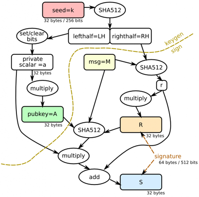

Digital Signatures
==================

.. currentmodule:: nacl.signing

You can use a digital signature for many of the same reasons that you might
sign a paper document. A valid digital signature gives a recipient reason to
believe that the message was created by a known sender such that they cannot
deny sending it (authentication and non-repudiation) and that the message was
not altered in transit (integrity).

Digital signatures allow you to publish a public key, and then you can use your
private signing key to sign messages. Others who have your public key can then
use it to validate that your messages are actually authentic.

Example
-------

Signer's perspective (:class:`~nacl.signing.SigningKey`)

.. code-block:: python

    import nacl.encoding
    import nacl.signing

    # Generate a new random signing key
    signing_key = nacl.signing.SigningKey.generate()

    # Sign a message with the signing key
    signed = signing_key.sign(b"Attack at Dawn")

    # Obtain the verify key for a given signing key
    verify_key = signing_key.verify_key

    # Serialize the verify key to send it to a third party
    verify_key_hex = verify_key.encode(encoder=nacl.encoding.HexEncoder)

Verifier's perspective (:class:`~nacl.signing.VerifyKey`)

.. code-block:: python

    import nacl.signing

    # Create a VerifyKey object from a hex serialized public key
    verify_key = nacl.signing.VerifyKey(verify_key_hex, encoder=nacl.encoding.HexEncoder)

    # Check the validity of a message's signature
    # Will raise nacl.exceptions.BadSignatureError if the signature check fails
    verify_key.verify(signed)

Reference
---------

.. class:: SigningKey(seed, encoder)

    Private key for producing digital signatures using the Ed25519 algorithm.

    Signing keys are produced from a 32-byte (256-bit) random seed value. This
    value can be passed into the :class:`~nacl.signing.SigningKey` as a
    :func:`bytes` whose length is 32.

    .. warning:: This **must** be protected and remain secret. Anyone who knows
        the value of your :class:`~nacl.signing.SigningKey` or it's seed can
        masquerade as you.

    :param bytes seed: Random 32-byte value (i.e. private key).
    :param encoder: A class that is able to decode the ``seed``.

    .. attribute:: verify_key

        An instance of :class:`~.nacl.signing.VerifyKey` (i.e. public key)
        that corresponds with the signing key.

    .. classmethod:: generate()

        Generates a random :class:`~nacl.signing.SigningKey` object

        :return: An instance of :class:`~nacl.signing.SigningKey`.

    .. method:: sign(message, encoder)

        Sign a message using this key.

        :param bytes message: The data to be signed.
        :param encoder: A class that is able to decode the signed message.

        :return: An instance of :class:`~nacl.signing.SignedMessage`.

.. class:: VerifyKey(key, encoder)

    The public key counterpart to an Ed25519 :class:`~nacl.signing.SigningKey`
    for producing digital signatures.

    :param bytes key: A serialized Ed25519 public key.
    :param encoder: A class that is able to decode the ``key``.

    .. method:: verify(smessage, signature, encoder)

        Verifies the signature of a signed message.

        :param bytes smessage: The signed message to verify. This is either
            the original message or the concated signature and message.
        :param bytes signature: The signature of the message to verify against.
            If the value of ``smessage`` is the concated signature and message,
            this parameter can be ``None``.
        :param encoder: A class that is able to decode the secret message and
            signature.

        :return bytes: The message if successfully verified.

        :raises nacl.exceptions.BadSignatureError: This is raised if the
            signature is invalid.

.. class:: SignedMessage()

    A bytes subclass that holds a messaged that has been signed by a
    :class:`SigningKey`.

    .. attribute:: signature

        The signature contained within the
        :class:`~nacl.signing.SignedMessage`.

    .. attribute:: message

        The message contained within the :class:`~nacl.signing.SignedMessage`.

Ed25519
-------

Ed25519 is a public-key signature system with several attractive features:

* **Fast single-signature verification:** Ed25519 takes only 273364 cycles
  to verify a signature on Intel's widely deployed Nehalem/Westmere lines of
  CPUs. (This performance measurement is for short messages; for very long
  messages, verification time is dominated by hashing time.) Nehalem and
  Westmere include all Core i7, i5, and i3 CPUs released between 2008 and
  2010, and most Xeon CPUs released in the same period.
* **Even faster batch verification:** Ed25519 performs a batch of 64
  separate signature verifications (verifying 64 signatures of 64 messages
  under 64 public keys) in only 8.55 million cycles, i.e., under 134000
  cycles per signature. Ed25519 fits easily into L1 cache, so contention
  between cores is negligible: a quad-core 2.4GHz Westmere verifies 71000
  signatures per second, while keeping the maximum verification latency
  below 4 milliseconds.
* **Very fast signing:** Ed25519 takes only 87548 cycles to sign a
  message. A quad-core 2.4GHz Westmere signs 109000 messages per second.
* **Fast key generation:** Key generation is almost as fast as signing. There
  is a slight penalty for key generation to obtain a secure random number
  from the operating system; /dev/urandom under Linux costs about 6000
  cycles.
* **High security level:** This system has a 2^128 security target; breaking it
  has similar difficulty to breaking NIST P-256, RSA with ~3000-bit keys,
  strong 128-bit block ciphers, etc. The best attacks known actually cost
  more than 2^140 bit operations on average, and degrade quadratically in
  success probability as the number of bit operations drops.
* **Collision resilience:** Hash-function collisions do not break this system.
  This adds a layer of defense against the possibility of weakness in the
  selected hash function.
* **No secret array indices:** Ed25519 never reads or writes data from secret
  addresses in RAM; the pattern of addresses is completely predictable.
  Ed25519 is therefore immune to cache-timing attacks, hyperthreading
  attacks, and other side-channel attacks that rely on leakage of addresses
  through the CPU cache.
* **No secret branch conditions:** Ed25519 never performs conditional branches
  based on secret data; the pattern of jumps is completely predictable.
  Ed25519 is therefore immune to side-channel attacks that rely on leakage of
  information through the branch-prediction unit.
* **Small signatures:** Ed25519 signatures are only 512-bits (64 bytes), one
  of the smallest signature sizes available.
* **Small keys:** Ed25519 keys are only 256-bits (32 bytes), making them small
  enough to easily copy and paste. Ed25519 also allows the public key to be
  derived from the private key, meaning that it doesn't need to be included
  in a serialized private key in cases you want both.
* **Deterministic:** Unlike (EC)DSA, Ed25519 does not rely on an entropy
  source when signing messages (which has lead to `catastrophic private key <http://www.mydigitallife.info/fail0verflow-hack-permanent-sony-ps3-crack-to-code-sign-homebrew-games-and-apps/>`_
  compromises), but instead computes signature nonces from a combination of
  a hash of the signing key's "seed" and the message to be signed. This
  avoids using an entropy source for nonces, which can be a potential attack
  vector if the entropy source is not generating good random numbers. Even a
  single reused nonce can lead to a complete disclosure of the private key in
  these schemes, which Ed25519 avoids entirely by being deterministic instead
  of tied to an entropy source.

The numbers 87548 and 273364 shown above are official
`eBATS <http://bench.cr.yp.to/>` reports for a Westmere CPU (Intel Xeon E5620,
hydra2).

Ed25519 signatures are elliptic-curve signatures, carefully engineered at
several levels of design and implementation to achieve very high speeds without
compromising security.

Algorithm
~~~~~~~~~

* **Public Keys:** `Curve25519 high-speed elliptic curve cryptography <https://cr.yp.to/ecdh.html>`_
* **Signatures:** `Ed25519 digital signature system <https://cr.yp.to/ecdh.html>`_

:k: Ed25519 private key (passed into :class:`~nacl.signing.SigningKey`)
:A: Ed25519 public key derived from k
:M: message to be signed
:R: a deterministic nonce value calculated from a combination of private key
    data RH and the message M
:S: Ed25519 signature
